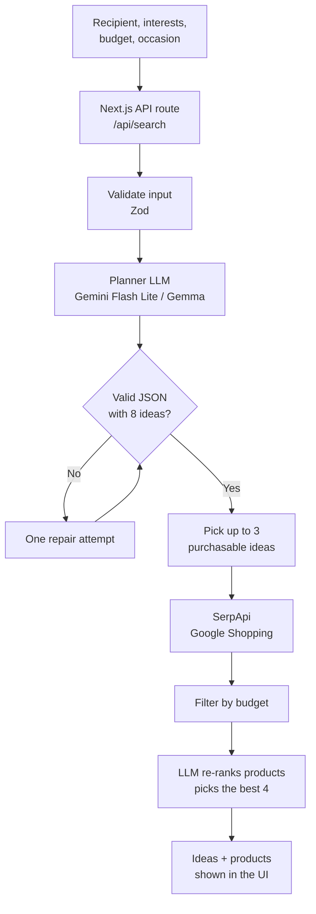

<div align="center">

# 🎁 Gift Hunter

**An AI agent that starts with the *person*, not the product search.**

Describe who you're shopping for, and Gift Hunter brainstorms eight distinct gift ideas, explains why each one fits, and then finds **real products with real prices** that match your budget.


[Live Demo](#) · [Report a Bug](../../issues) · [Request a Feature](../../issues)


</div>

---

## 📖 Table of Contents

- [Why Gift Hunter?](#-why-gift-hunter)
- [Features](#-features)
- [Screenshots](#-screenshots)
- [How It Works](#-how-it-works)
- [Tech Stack](#-tech-stack)
- [Getting Started](#-getting-started)
- [Project Structure](#-project-structure)
- [Design Decisions](#-design-decisions)
- [Roadmap](#-roadmap)
- [Acknowledgements](#-acknowledgements)

---

## 💡 Why Gift Hunter?

Typing "gift for a coder" into a search engine gives you a pile of products and no help deciding what would feel *personal*.

Gift Hunter flips the flow:

1. You describe the **recipient**: interests, personal clues, budget, occasion.
2. An LLM turns that brief into **eight varied gift directions**, each with a reason and a personal finishing touch.
3. The app searches **Google Shopping** for the strongest purchasable ideas and shows real listings under each one.

The model does the thinking. The search grounds it in real, buyable products, so there are no hallucinated items.

---

## ✨ Features

- 🧠 **Recipient-first planning**: eight distinct gift ideas across different categories (tech, book, experience, subscription, food, handmade, accessory, hobby gear).
- 💬 **Personal touch**: every idea comes with a "why it fits" and a finishing touch (engraving, a handwritten note, etc.).
- 🛒 **Real products**: live Google Shopping results through SerpApi, with images, prices and links.
- 💵 **Budget filtering**: only products within the budget are shown (USD).
- 🎯 **Smart product ranking**: the LLM re-ranks candidate listings and picks the 4 that best fit the idea and the recipient's interests.
- 🛍️ **Purchasable-first search**: experiences and subscriptions are shown as ideas, while shopping searches are spent only on ideas that can actually be bought.
- ✅ **Validated AI output**: strict JSON schema with [Zod](https://zod.dev), plus a one-shot automatic repair if the model returns invalid JSON.
- 🔁 **Resilient API calls**: automatic retries on `429 / 500 / 503`.
- ⚡ **Caching**: repeated shopping queries are served from memory to save API quota.
- 🌍 **Arabic-friendly UI**: Arabic interface and Arabic gift descriptions, with English search queries for better shopping results.

---

## 📸 Screenshots

| Brief form | Gift directions |
|:---:|:---:|
|  |  |
| **Verified product picks** | **Mobile view** |
|  |  |

---

## 🔍 How It Works



**In short:**

1. The browser sends the brief to `/api/search`.
2. The server validates it, asks the LLM for exactly 8 ideas as JSON, and validates the result against a schema.
3. The top 3 *purchasable* ideas are searched on Google Shopping (`gl=us` so prices come back in USD).
4. Results are filtered by budget, then the LLM ranks them and keeps the best four per idea.
5. The UI renders every idea as a card, with products under the ones that have them.

> All model and SerpApi calls happen **on the server only**, so API keys never reach the browser.

---

## 🧰 Tech Stack

| Layer | Technology | Purpose |
|---|---|---|
| Framework | Next.js 16 (App Router), React 19 | UI and API routes |
| Language | TypeScript | Type safety |
| Styling | Tailwind CSS | Responsive UI |
| Validation | Zod | Input and LLM output schemas |
| AI | Google Gemini API (Flash Lite by default, Gemma 4 supported) | Gift planning and product ranking |
| Shopping data | SerpApi (Google Shopping) | Real products and prices |
| Hosting | Vercel | Deployment |

---

## 🚀 Getting Started

### Prerequisites

- Node.js **18+** (20 recommended)
- A [Google AI Studio](https://aistudio.google.com) API key
- A [SerpApi](https://serpapi.com) API key (the free plan has a limited number of searches per month)

### Installation

```bash
git clone https://github.com/<your-username>/gift-hunter.git
cd gift-hunter
npm install
```

### Environment variables

Create a `.env.local` file in the project root:

```env
GOOGLE_AI_API_KEY=your_google_ai_studio_key
SERPAPI_KEY=your_serpapi_key
```

> ⚠️ Never commit `.env.local`. It is already ignored by `.gitignore`.

### Run

```bash
npm run dev
```

Open [http://localhost:3000](http://localhost:3000).

### Test the API without the UI

```bash
curl -X POST http://localhost:3000/api/search \
  -H "Content-Type: application/json" \
  -d '{"recipient":"Ahmed","interests":"coding, coffee","budget":"100","occasion":"birthday"}'
```

### Choosing the model

The model is set in `lib/planner.ts`:

```ts
const MODEL = "gemini-flash-lite-latest"; // ~2-8 s per request
// const MODEL = "gemma-4-26b-a4b-it";    // open-weight, but ~50-60 s (it "thinks" first)
```

Gemma 4 works through the same API but is much slower, which is too slow for an interactive UI and for Vercel's function time limits. Use Flash Lite for the app and Gemma if you want an open-weight setup.

---

## 🗂️ Project Structure

```
gift-hunter/
├── app/
│   ├── api/
│   │   └── search/
│   │       └── route.ts      # POST endpoint: validate → plan → shop
│   ├── page.tsx              # Form + idea cards + product list
│   ├── layout.tsx
│   └── globals.css
├── lib/
│   ├── schema.ts             # Zod schemas for ideas and plans
│   ├── planner.ts            # LLM calls, prompt, retries, repair, product ranking
│   └── shopping.ts           # SerpApi search, budget filter, cache
├── docs/
│   └── screenshots/          # README images
├── .env.local                # secrets (not committed)
└── package.json
```

---

## 🧠 Design Decisions

- **Server-side only for secrets.** The browser talks to `/api/search`, and the server talks to Google and SerpApi.
- **Never trust raw LLM output.** Responses are parsed, stripped of markdown fences, and validated with Zod. Invalid output gets exactly one repair attempt, so it can't loop forever.
- **English search queries.** The UI and the descriptions are Arabic, but the model also returns an English `search_query` because Google Shopping gives much better results in English.
- **Don't spend searches on non-products.** Ideas such as workshops or subscriptions can't be found on Google Shopping, so only purchasable categories trigger a SerpApi call.
- **LLM re-ranking instead of keyword matching.** Matching interest words in product titles fails when interests are in Arabic and titles are in English. Letting the model judge fit is more robust. It fails gracefully: if ranking fails, the original order is used.
- **Fixed currency and region.** `gl=us&hl=en` keeps prices in USD so the budget filter compares like with like.

---

## 🗺️ Roadmap

- [ ] **Rate limiting** to protect the free API quota on a public deployment
- [ ] **MongoDB Atlas** to save search briefs
- [ ] **Friend profiles**: reusable, user-controlled profiles built from saved briefs
- [ ] **Gift memory**: record what was already given to avoid repeats
- [ ] **Chat agent**: follow-up questions such as "what do you think of the second idea?"
- [ ] **Vector search** for related gifts even when the wording differs
- [ ] **Multi-currency** support (EGP, EUR, ...)
- [ ] **Persistent cache** (Redis / MongoDB), since in-memory cache is weak on serverless
- [ ] **`responseSchema`** (structured output) to reduce repair calls

---

## 🙏 Acknowledgements

Inspired by the [Gift Hunter Agent](https://dev.to/dj29/gift-hunter-an-ai-agent-that-finds-gifts-theyll-actually-want) by Dhruv Jani, built for the DEV Hacktoberfest "Build for a Friend" challenge. This version is a from-scratch re-implementation with my own improvements (LLM product ranking, purchasable-first search, caching, Arabic UI).

---

<div align="center">

Made with ☕ and a lot of debugging.

</div>
